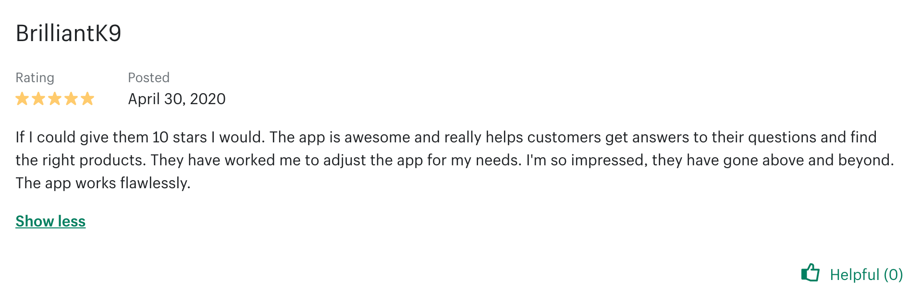
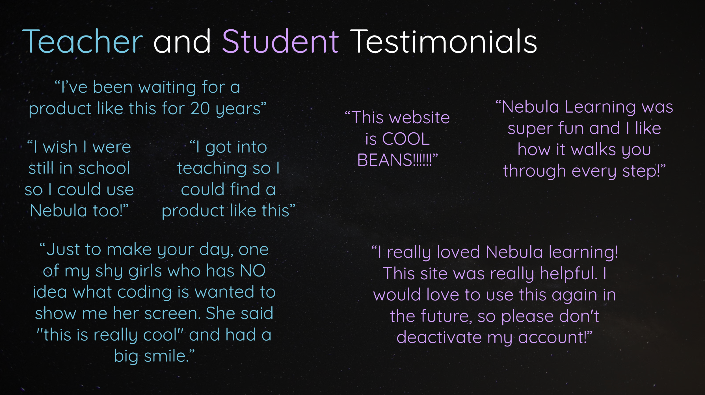

While it doesn't have to be the _most_ important consideration when building a new project, having users/customers who really love what you're doing is often a major motivating factor for the people you're working with (coworkers, investors, or otherwise) to keep going. 

There's certainly merit to building things primarily for yourself, but if you have users/customers who are thrilled with your work, it not only can inspire you when you're questioning yourself, but even help convince others to join your cause into the future.

## Toucan AI Customer Testimonial Video {#testimonial}
This testimonial video was created with the much-appreciated help of [Niki Shamdasani](https://www.linkedin.com/in/nikishamdasani), the co-founder of [Sani Designs](https://www.sanidesigns.com) and an early advocate of my latest company, [Toucan AI](./startups/toucan-ai):

<iframe width="560" height="315" src="https://www.youtube.com/embed/VXDF_wyeVmI" title="YouTube video player" frameborder="0" allow="accelerometer; autoplay; clipboard-write; encrypted-media; gyroscope; picture-in-picture" allowfullscreen></iframe>

## Shopify Reviews of Toucan {#shopifyReviews}
The reviews [seen here](https://apps.shopify.com/toucan-ai/reviews?sort_by=helpful) came from various customers of ours at Toucan throughout the years, all small business owners selling a variety of different products via e-commerce. 

## Nebula Learning Reviews {#nebulaReviews}

The reviews below were sourced from a group of teachers and students who used the [Nebula Learning](./startups/nebula-learning) platform in a variety of public, charter, and private schools within their classrooms. 

[Return to homepage](../)
