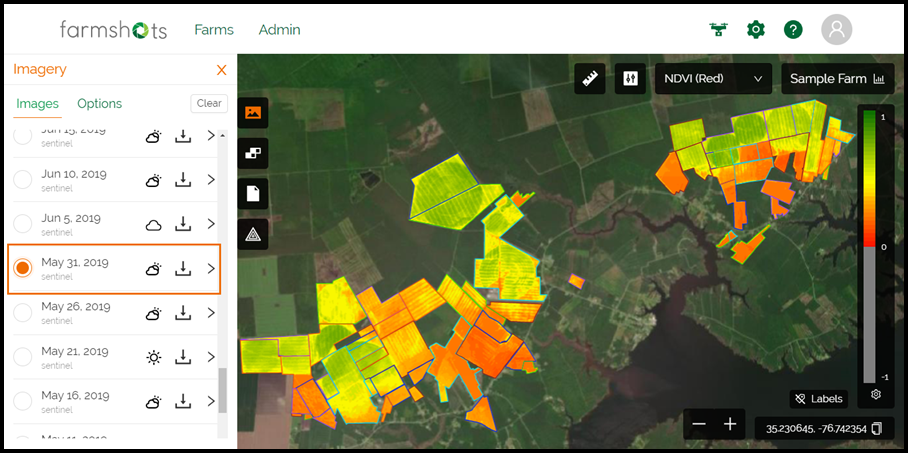

## What was Farmshots? 

[**Farmshots**](https://www.farmshots.com) is a tool that allows agronomists and farmers to use satellite imagery to identify pests and diseases in their farms. 

It was founded by my friend, former boss, and former investor (in [Toucan AI](./toucan-ai)), [Josh Miller](https://www.linkedin.com/in/joshmichaelmiller/), while he was in undergrad at Duke. We met while in [The Cube](../notstartups#cube), Duke's entrepreneurship-focused living group, and during the summer of 2016, while Farmshots was going through the [YCombinator Fellowship](https://blog.ycombinator.com/yc-fellowship/) program, Vishnu (my co-founder at Toucan and [Nebula Learning](./nebula-learning)) and I both interned for Farmshots. 

## Skill Development {#skills}

While I was initially hired as a front-end software engineer (my undergrad degree is in computer science), the grueling yet rewarding summer at Farmshots gave me the opportunity to explore a variety of other interests, most notably sales and fundraising. Josh brought me in on his sales calls and even allowed me to run my own, helping me to expand my repertoire and accelerate my confidence in business settings. He introduced me to Farmshots' investors and painted a detailed, authentic picture of what it was like to be grateful for and beholden to stakeholders far richer and more powerful than you. 

## How I Met ~~Your Mother~~ My Co-Founder {#vishnu}

That summer also created the perfect breeding ground for the blossoming of my close friendship and future working relationship with Vishnu. Everyone working at Farmshots (5 people with stake in the company and 4 interns) lived together that summer in Durham, NC (not too far from Duke), and the two of us began to talk every day, not just about our ideas and ambitions for startups, but about food, life, and the things that make us tick. 

It was a pivotal summer both socially and professionally, and it was during this time that Vishnu and I started working on the first startup we'd try to build together.

[Check out my next startup adventure](./nebula-learning) (or my [previous one](./physao))

[See the full startup list](../startups)

[Return to homepage](../..)