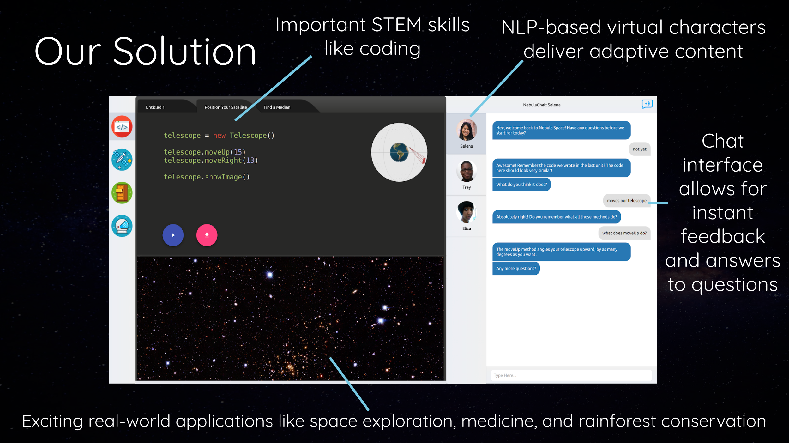

## What was Nebula Learning? {#nebula}

[Nebula Learning](https://twitter.com/nebulalearning) was an educational web platform that used coding concepts to help teach middle school curriculum math. 

## The Origins {#origins}

My friend [Vishnu](https://www.linkedin.com/in/vishnu-menon/) (who would later be my co-founder at [Toucan AI](./toucan-ai)) and I started this company with a few of our classmates while in undergrad at Duke. We had gotten close during our summer jointly interning for [Farmshots](./farmshots), and he was really excited about working on an edtech (educational technology) startup that taught coding concepts. 

After we both got our first real dose of a legitimately functional, revenue-producing startup like Farmshots, we had an idea for how we wanted to go about taking Nebula seriously. We set Saturday workdays, in which we'd go to the local coworking space in downtown Durham, NC, (called the [American Underground](https://americanunderground.com/)), and sit and work on our startup all day long. 

## Highlights {#highlights}

As junior and senior year of college progressed, we got increasingly serious about Nebula, and much of our college coursework fell to the wayside. 

We ended up applying to and getting into [Melissa & Doug Entrepreneurs](https://entrepreneurship.duke.edu/melissa-doug/), Duke's flagship student entrepreneurship program. 

> A bit of background here: [Melissa & Doug](https://www.melissaanddoug.com/) is a huge children's toy designer and manufacturer in the US—-chances are, if you have a kid in the US, they've likely seen, played with, or own an M&D product of some sort (maybe a wooden puzzle or a stuffed animal). 
>
> Melissa and Doug Bernstein, the founders of M&D, started the M&D Entrepreneurs program at Duke (Melissa is a Duke alum) as a way of providing student founders with funding (without taking equity) so they could work on their startups instead of doing an internship over the summer. 
>
> The point of the program is to provide guidance and mentorship to students as they're building their startups (from people who have founded companies themselves), as well as connections to investors and relevant people and a Demo Day at Melissa & Doug's house at the end of the program, during which you pitch to a group of investors. 

The summer between junior and senior year, through the M&D Enterpreneurs program, Vishnu and I (and a few of our classmates) built out the web platform and got together a group of interested teachers and schools to pilot out the program. 

Ultimately, we ended up piloting it in 7 schools (public, private, and charter) with over 500 students throughout, both as summer and in-year programs! We had [a lot of excitement from teachers and students](../reviews#nebulaReviews) (and even some commitment from investors at the M&D Demo Day), but ultimately, we found that the money from schools just wasn't there to help fund what we were looking to build. 

Regardless, it formed the foundation for my startup-founding working relationship with Vishnu, and it helped us envision what it would be like (from a commitment perspective, especially) for us to start something once we graduated from college. 

[Check out my next startup adventure](./toucan-ai) (or my [previous one](./farmshots))

[See the full startup list](../startups)

[Return to homepage](../..)